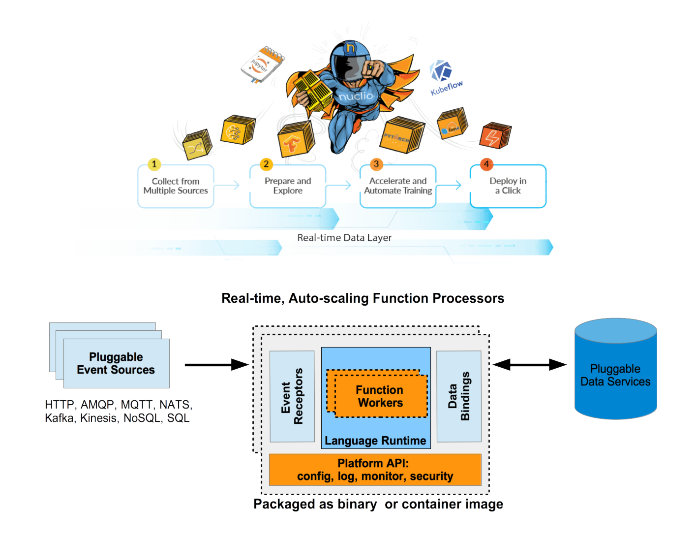
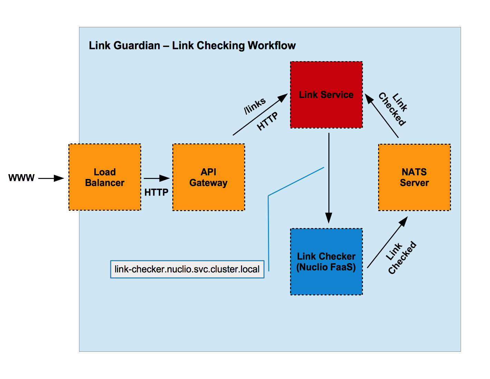

# Link Guardian Microservice including Nuclio (K8s, Serverless FaaS Processor Engine) API 

The Link Guardian microservice proivdes url link validation or invalidation services on request. The service includes
REST API using Go (Go-kit and Gorilla Mux Toolkit APIs) and includes a top-level Nuclio FaaS Function Processor handler (see package `svc_fun`)
that provides a Nulcio `function.yaml` and a corresponding Nuclio Handler that delegates its service processing to the `svc/link_guardian_service` package
APIs to fulfill the serivce request.

## The Nuclio (Serverless) FaaS Processor Engine Architecture
The following graphic depicts the architecture of Nuclio.

## The Nuclio FaaS Processor Service Dispatch Distribution Patterns Architecture
The following graphic depicts the processor servicing distribution patterns architecture of Nuclio.

## The Link Guardian Microservice Architecture (using Nuclio)
### The Link Guardian Link Checking Worflow is a follows:

###### `1.` The Link Manager will invoke a serverless function upon adding a new link.
###### `2.` The new link will initially hold in a pending state.
###### `3.` The serverless function will only check that the link is reachable.
###### `4.` The serverless function will send an event through the NATS event queue engine, which the link manager will subscribe to.
###### `5.` The link manager will update the link status from `pending` to  `valid` of `invalid` when it receives the event.

### The following graphic depicts the architecture workflow of the Link Guardian microservice using Nuclio.

## ToC : The Package Directories for Link Guardian

###### `cmd` : 
This package will include e-to-e (End to End) tests - Not yet concluded, yet not critical for deploying this microservice.

###### `svc`: 
This package includes the actual service APIs (Go, Go-Kit and Gorilla Mux HTTP API) for the microservice.
######  `svc/link_guardian_service`: 
This is the a specific service package to validate or invalidate a URL link.
###### `svc_fun`: 
This package includes Nuclio FaaS Function Processor reqs (provide a req/res API Handler and a function.yaml for K8s deploy into the cluster)
###### `svc_kit`: 
This package follows the 12 factor standard to include a 'kit' package that provide fine grained services that provide APIs for data storage access, metrics, tracing delegation and retain service SoC.

## Installing and Configuring Nuclio onto K8s (Minikube, GKE, *)

###### `Critical Point`: At this instance, Nuclio FaaS Function Processor does not widely run on Kind or K3s (Docker-in-Docker K8s)
and only has a widely tested history on K8s local (Minikube) and cloud-K8s orhestration engines  (GKE, AWS EKS).

###### `1.` Create Nuclio namespace into the cluster

`kubectl create namespace nuclio`

This is good security practice as Nuclio will not interfere with your cluster. Nuclio namespace K8s resources
are lightweight and it serves as a lightweight tenant to the cluster. Next step is to apply RBAC permissions for the 
Nuclio resources. The RBAC permissions are scoped to the `nuclio` namespace. The following step installs the Nuclio CRDs into the
cluster.

###### `2.` Install the Nuclio RBAC resources into the cluster

`kubectl apply -f https://raw.githubusercontent.com/nuclio/nuclio/master/hack/k8s/resources/nuclio-rbac.yaml`

Next is to deploy Nuclio itself.

###### `3.` Install the Nuclio resources into the cluster.

`kubectl apply -f https://raw.githubusercontent.com/nuclio/nuclio/master/hack/k8s/resources/nuclio.yaml`

###### `4.` Verify Nuclio K8s CRDs and resources are installed into the cluster.

